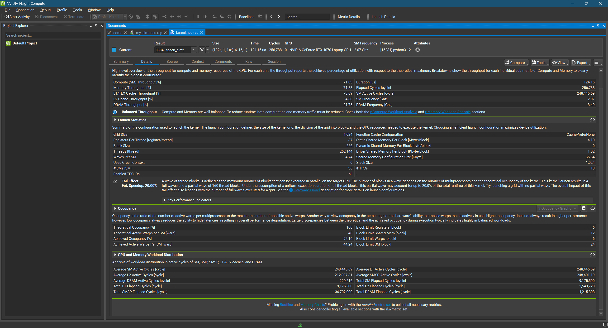

# MXFP8 / NVFP4 软件量化、反量化与推理接入

2026 夏季训练营 CUDA 项目 · 0xtoward

## 1. 完成内容

| 项目要求 | 实现 |
|---|---|
| FP32/FP16 矩阵输入 | 二进制文件 + TOML 配置；Python API 另支持 BF16 |
| MXFP8 / NVFP4 | 软件编码、缩放、真实位宽打包、保存与加载 |
| 缩放 / 舍入 | block、tensor；nearest-even、stochastic |
| CUDA 反量化 | 输出 FP16 / BF16 / FP32 |
| 误差 / 性能 | MaxAbs、MAE、MSE、相对 L2、压缩率、kernel 时间、有效带宽 |
| 测试 | 独立 NumPy 参考、官方 oracle、随机/正态/异常值、真实权重、内存检查 |
| 扩展 | Four Over Six、CUDA Math API/Triton 对照、模型 HTTP 接入、Marlin 学习与优化 |

基础实现仅用普通 CUDA 指令。主要成果：真实权重上 4over6 将 NVFP4 MSE 降低 **15.9%**，存储量不变；Qwen3.5-0.8B 的 186 个 Linear 完成低精度接入；进一步研究融合 dequant+GEMM，完成 Marlin 小 M 调度优化及独立重写实验。

## 2. 格式、缩放和布局

### 2.1 MXFP8

每行沿连续 K 方向分组，32 个 E4M3 元素共享一个 E8M0 scale。设块最大值为 a：

`S = 2^e; q_i = Q_E4M3(x_i / S); x_hat_i = D_E4M3(q_i) × S`。

E4M3 为符号/指数/尾数 1/4/3 位，最大有限值 448，最小正次正规数 2^-9。E8M0 保存 e+127，255 为 NaN 编码。零块 scale 编码为 0。

| scale 策略 | 公式 | 使用场景 |
|---|---|---|
| FLOOR | e=floor(log2(a))-8 | 格式教学和实现对照；最大值可能饱和 |
| RCEIL | e=ceil(log2(a/448)) | 容纳块最大值；模型加载采用此策略 |

指数限制在 [-127,127]。两种策略使用同一存储格式。

### 2.2 NVFP4 与 Four Over Six

E2M1 的非负数值为 `{0,0.5,1,1.5,2,3,4,6}`，加符号位共 4 bit。每 16 个元素共享 E4M3 局部 scale，全张量共享 FP32 scale。

设全局最大值 A、块最大值 a_b，普通 NVFP4 的 F=448：

`g=A/(6F); s_b=Q_E4M3(a_b/(6g)); q_i=Q_E2M1(x_i/(g×D_E4M3(s_b)))`。

`x_hat_i = D_E2M1(q_i) × D_E4M3(s_b) × g`。

零张量使用 g=1，局部 scale/元素为零。CUDA 使用显式 FP32 运算顺序和最近偶数舍入，与官方 reference 对齐。

4over6 使用 F=256，比较 `s6=Q(a_b/(6g))` 与 `s4=Q(a_b/(4g))`，分别量化、重建，选择块内平方误差更小的候选；相等选 6。scale 的舍入误差一起参与评分。选项已包含在 scale 中，不增加标志位，反量化保持不变。

### 2.3 packed layout 与文件

| 格式 | 元素布局 | scale | P 个整块元素的字节数 | BF16 / FP32 压缩比 |
|---|---|---|---|---|
| MXFP8 | 每元素 1 byte | 每 32 元素 1 byte | P+P/32 | 1.939× / 3.879× |
| NVFP4 / 4over6 | 每 byte 两元素：偶数列低 nibble，奇数列高 nibble | 每 16 元素 1 byte + 全局 4 bytes | P/2+P/16+4 | 约 3.556× / 7.111× |

奇数列尾部高 nibble 补零，每行独立打包。quant 文件依次为 magic、JSON 长度、header、packed data、局部 scale、可选全局 scale；tensor 文件保存 header 和行主序数据。header 记录行列数、dtype、格式、缩放/舍入策略和各段长度。压缩比表按 payload 计算，CLI 另报含 header 的文件字节数。

`scale_mode=tensor` 为整张量共享 scale 的对照模式；标准 block 格式分别采用 32/16 分组。

## 3. 实现与优化

| 路线 | 关键实现 | 架构/库依赖 |
|---|---|---|
| 软件 CUDA core | warp shuffle 求块最大值；手写 E4M3/E2M1；软件 BF16 舍入 | 编译 SM75/SM89，无 FP8/FP4 Tensor Core |
| NVFP4 打包 | 偶数 lane 取相邻奇数 lane 编码，一次写完整 byte | 无相邻线程 read-modify-write 竞争 |
| dequant | 读 byte、拆 nibble、解码、乘 scale、写目标类型 | 普通 CUDA load/store/算术 |
| CUDA Math API | 官方 FP8 类型替换手写 MXFP8 转换 | CUDA Toolkit 的 FP8 类型 |
| Triton | 每 program 合并 8 个量化块，编译期消除格式分支 | 本机 SM89 FP8 转换路径 |
| 4over6 | 多一个 scale 候选和误差归约 | quant 成本增加，dequant 不变 |

两个实现问题通过逐字节比较定位：一是 `x/(g*s)` 与 `x*(1/(g*s))` 的浮点舍入差异；二是 FP32→FP16→FP8 的双重舍入。固定运算顺序、明确 FP32→FP8 转换后，对齐 packed bytes 和 scale。

## 4. 正确性与误差

| 测试 | 结果 |
|---|---|
| dtype、尾块、block/tensor、输出 dtype | 180 组合通过 |
| CUDA/Triton 形状、类型、策略 | 36 组合逐字节通过 |
| 官方 NVFP4 / 4over6 reference | 随机 FP32/BF16 与真实 BF16，共 6 组 data/scale 零差异 |
| 随机舍入、stream、文件 | 同 seed 可复现；非默认 stream、奇数列往返、截断拒绝通过 |
| Compute Sanitizer | memcheck 0 errors |

令 d=x_hat-x，以 FP64 累加：MaxAbs=max|d|，MAE=Σ|d|/P，MSE=Σd²/P，相对 L2=√(Σd²/Σx²)。完整结果见 [accuracy.md](accuracy.md) 和 [原始 JSON](results/accuracy.json)。

### 三种分布

均为 1024×1024 FP32；异常值输入每 97 个元素放大 30 倍。下表为相对 L2。

| 输入 | MX FLOOR | MX RCEIL | NVFP4 | 固定6/F256 | 4over6 |
|---|---:|---:|---:|---:|---:|
| 均匀 [-1,1] | 0.048805 | 0.023657 | 0.101664 | 0.101432 | 0.087240 |
| 标准正态 | 0.029334 | 0.026517 | 0.095113 | 0.095123 | 0.086956 |
| 正态 + 异常值 | 0.039569 | 0.026242 | 0.080953 | 0.080916 | 0.079044 |

### Qwen3.5-0.8B 真实权重

选取 attention/MLP 共 8 个矩阵、29,884,416 个 BF16 元素，量化后反量化到 FP32，按总元素数聚合。

| 方法 | MaxAbs | MAE | MSE | 相对 L2 |
|---|---:|---:|---:|---:|
| MXFP8 FLOOR | 0.029297 | 2.4827e-4 | 1.9006e-7 | 0.030058 |
| MXFP8 RCEIL | 0.015625 | 2.3793e-4 | 1.4897e-7 | 0.026611 |
| NVFP4 | 0.043480 | 9.5078e-4 | 1.8895e-6 | 0.094773 |
| 固定6/F256 | 0.046875 | 9.5099e-4 | 1.8903e-6 | 0.094793 |
| NVFP4 + 4over6 | 0.046875 | 9.1508e-4 | 1.5887e-6 | 0.086904 |

RCEIL 较 FLOOR 的 MSE 降低 21.6%；4over6 较 NVFP4 降低 15.9%，较同 F256 的固定6降低 16.0%。优化目标是块内 MSE，因此最大误差可以与 MSE 反向变化。

## 5. 性能

环境：RTX 4070 Laptop 8 GiB、36 SM、WSL Ubuntu、CUDA 12.6、driver 596.49、Python 3.12、PyTorch 2.13.0+cu130、Triton 3.7.1、Transformers 5.16.1。

4096×4096 FP32 输入/输出，MX 采用 FLOOR。CUDA Event：预运行 1 次、warmup 5 次、丢弃首样本、31 样本中位数，每次正式测量前 256 MiB L2 thrash；输出预分配，全局 amax 已准备。有效带宽=(输入+输出+scale 字节)/时间。

| 格式 | 实现 | Quant ms | Dequant ms | Quant GB/s | Dequant GB/s |
|---|---|---:|---:|---:|---:|
| MXFP8 | 软件 CUDA | 0.7352 | 0.4280 | 114.8 | 197.2 |
| MXFP8 | CUDA Math API | 0.5847 | 0.3963 | 144.4 | 213.0 |
| MXFP8 | Triton | 0.3850 | 0.3389 | 219.2 | 249.1 |
| NVFP4 | 软件 CUDA | 1.5247 | 0.6001 | 50.2 | 127.6 |
| NVFP4 | Triton | 0.3891 | 0.3082 | 196.7 | 248.3 |
| NVFP4 + 4over6 | 软件 CUDA | 3.3679 | 0.6001 | 22.7 | 127.6 |
| NVFP4 + 4over6 | Triton | 0.5509 | 0.3082 | 138.9 | 248.3 |

全局 amax 单独计时，例如 512×1024 FP16 NVFP4：amax 约 0.049 ms，quant 约 0.084 ms。512×1024 的 NumPy 参考量化为 MXFP8 48.38 ms、NVFP4 30.26 ms；对应 CUDA kernel 为 0.0297/0.0553 ms。CPU 计时含分配，GPU 为 kernel 时间。完整分布及另一组形状见 [benchmark.md](benchmark.md)。

Triton 合并多个块，减少小 CTA 开销；手写 FP4 枚举 8 个值，代码直接、成本较高。性能记录保留中位数和 p20/p80；本机 GPU 同时承担显示任务。

## 6. 模型接入测试

链路：CPU checkpoint → 逐层 CUDA quant → GPU 常驻 packed 权重 → 每次 Linear 的 CUDA dequant → BF16 `F.linear` → HTTP 生成。使用 Transformers eager/SDPA；embedding、head、norm、视觉分支保留 BF16。

Qwen3.5-0.8B 转换 186 个 Linear：原始权重 995,229,696 bytes；MXFP8 513,165,312 bytes；NVFP4/4over6 279,909,096 bytes，后者节省 682.2 MiB。

| 权重 | 加载后 allocated GiB | 固定答案正确数 / 8 |
|---|---:|---:|
| BF16 | 1.617 | 5 |
| MXFP8 RCEIL | 1.186 | 5 |
| NVFP4 | 0.940 | 3 |
| NVFP4 + 4over6 | 0.940 | 4 |

题型含算术、ABCD 选择、关键词提取、排序、倒序和常识。Greedy 解码，规范化后 exact match；另有一题中文解释。完整请求、原始回答、token、显存和延迟见 [smoke_small.json](results/smoke_small.json)。

四组均提取出 `lantern`；倒序题 BF16/MXFP8 正确，两种 NVFP4 错误。4over6 的中文算术结果为 10，但多输出解释，因此严格匹配未通过。这里验证了真实生成链路及回归差异，后续以公开任务集扩大质量评估。

## 7. Marlin：从独立反量化到融合 GEMM

后续学习与实验见 [2026-09-22 Marlin 补记](MARLIN_LEARNING.md)：知乎/源码优化思路、CUDA Core 小 M 终版、cp.async 与 warp specialization 对照，以及新的推理结果和 TODO。本节保留首次提交时的实验记录。

静态 quant 通常只做一次；dequant 随每次 Linear 重复。独立展开会写出整块 BF16 权重，再由 GEMM 读回。Marlin 在片上解码并直接供 MMA 消费，减少这部分显存流量。Ada 上研究的是 W8A16/W4A16，使用 BF16/FP16 Tensor Core；基础 codec 与它分开实现。

### 已尝试的优化

| 实验 | 结果与学习 |
|---|---|
| MXFP8 direct-grid + 小 M N256 分档 | 完整输出 tile 交给一个 CTA，省去条带控制和跨 CTA reduction；15 组同源 Nsys A/B 加速 1.021–1.102× |
| atomic / 更浅流水 / scale 展开 / 预取 hint | 已测试；收益不足或精度不合格的配置回退 |
| 反量化乘法减半 | HFMA2 262144→131072，寄存器 158→152；重复 Nsys 无稳定额外加速，回退 |
| 独立 MXFP8 重写 | SIMT→寄存器 MMA→split-K→last-CTA→K 重排与预取；最终接近原版，但未超过 Ada-v2 |
| NVFP4 direct-grid | MLP gate/up M32/N7168/K1024：32.672→27.295 μs，kernel 时延降低 16.46% |
| NVFP4 scale 域修复 | 保留 tiny scale，避免预处理丢失小值；4096 值域组合、270 GEMM 组合通过 |
| CUDA Core 教学版 | padding 消除 shared-store bank conflict；软件双缓冲进一步隐藏加载等待 |

真实形状来自 Qwen 的 attention 投影和 MLP，不仅是 attention。MXFP8 同源 A/B 的三组 M32 示例：

| N,K | 上游 μs | Ada-v2 μs | 加速比 |
|---|---:|---:|---:|
| 1024,2048（attn out） | 18.048 | 16.384 | 1.102× |
| 7168,1024（MLP gate/up） | 49.567 | 45.375 | 1.092× |
| 1024,3584（MLP down） | 27.839 | 25.504 | 1.092× |

小 M 主范围 1/2/4/8/16/32，冷 L2、AB/BA 交替、相同 packed 权重。912 项最终回归通过，对 FP32 decoded-weight GEMM 的最大相对 L2 为 3.41816e-4。更多真实权重形状与原始 profile 摘要保存在 `results/marlin/`。

### NCU / SASS 分析

| QKV M16 指标 | 上游 | Ada-v2 | 解释 |
|---|---:|---:|---|
| NCU duration μs | 38.936 | 36.296 | 调度简化收益 |
| registers/thread | 148 | 96 | 控制与中间状态减少 |
| DRAM GB/s | 223.95 | 240.91 | 权重搬运更充分 |
| achieved occupancy % | 16.64 | 16.705 | 仍受 shared memory 限制 |
| shared bytes/CTA | 102400 | 102400 | 主流水未变 |
| barrier cycles/issue | 3.84 | 2.45 | 同步等待降低 |

SASS 中 `HMMA` 数量保持 65536，`HFMA2` 保持 262144，而 `BAR.SYNC` 8960→5376、`BRA` 31748→15232。优化减少的是调度、同步和归约，不是少算矩阵元素。乘法减半实验进一步说明：减少算术指令未必改善由权重搬运主导的路径。

CUDA Core 教学版固定 M4/N16384/K256、tile16×16×32：

| 版本 | Event μs | shared-store bank conflicts | 寄存器/线程 |
|---|---:|---:|---:|
| original | 106.496 | 1,966,080 | 37 |
| padding | 100.352 | 0 | 37 |
| 双缓冲 | 82.944 | 0 | 40 |

padding 将 `Bs[32][16]` 改成 `[32][17]`，使转置写均匀落在 32 个 bank。双缓冲提前加载下一 K 块到寄存器，在当前块 FFMA 后发布到另一份 shared；K256 的 barrier 从 16 次降为 8 次。这是普通 LDG 的软件流水线。见 `results/marlin/simt_*_metrics.json`。

下图为优化前教学版 NCU：grid1024、36SM、每SM最多6CTA，因此 1024/(36×6)=4.74 waves。虽然 occupancy 为 92.16%，仍可通过访存布局与流水线继续优化。

重写版本的 Qwen eager、无 graph E2E（128 输入、64 输出 token，8 轮）结果：

| batch | upstream 秒 | Ada-v2 秒 | rewrite 秒 |
|---|---:|---:|---:|
| 1 | 1.6753 | 1.6977 | 1.7108 |
| 8 | 1.8152 | 1.8024 | 1.8733 |

各组输出 token 一致，B8 独立重写较 Ada-v2 慢约 3.9%。最终保留 Ada-v2 作为融合算子的优化方向，独立重写用于理解布局、发布顺序和流水线取舍。

## 8. TODO

| 优先级 | 下一步 | 验收方式 |
|---|---|---|
| P0 | ARC 等公开选择题集、敏感层保留高精度 | BF16/MXFP8/NVFP4/4over6 同输入正确率 |
| P0 | 把自己的 packed 权重接到融合低精度 Linear | 精度、峰值显存、eager/graph E2E |
| P1 | 多 warp 合并块、FP4 转换、全局归约优化 | 固定缓存口径的 quant/dequant A/B |
| P1 | 分离提交 Marlin direct-grid 与 scale 修复 | 多形状、多 dtype、边界和并发回归 |
| P1 | T4 实机与独占 Ada 复测 | 可移植性、稳定时延、资源占用 |

## 9. 参考

- [OCP MX 规范](https://www.opencompute.org/documents/ocp-microscaling-formats-mx-v1-0-spec-final-pdf)
- [Four Over Six 论文](https://arxiv.org/abs/2512.02010)；[官方实现](https://github.com/mit-han-lab/fouroversix)，oracle commit `dadfad6901d473a734fe71e0b082e70ee993e23a`
- [原始 Marlin](https://github.com/IST-DASLab/marlin)；[vLLM 基线](https://github.com/vllm-project/vllm/tree/4cc0cb6f76a608622a29d9ea8f4d415697e21364/csrc/libtorch_stable/quantization/marlin)

基础 codec、模型接入源码及必要测试随本提交提供；Marlin 部分提交学习结论和测量证据，完整 vLLM 实验分支不并入最小 codec。
